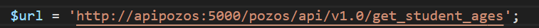
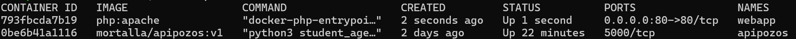
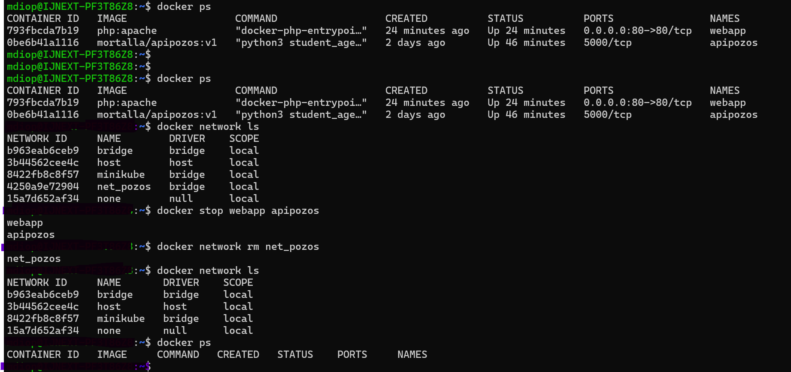
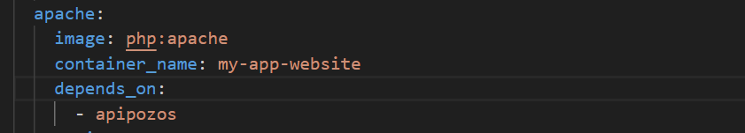
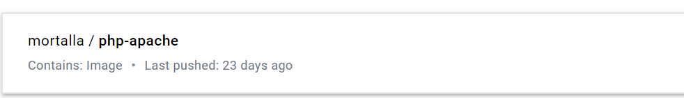
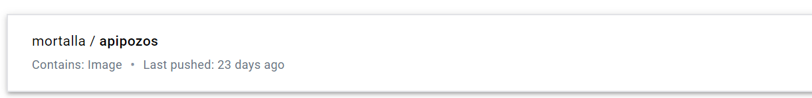

***I'm working on my own machine and not on a cloud Platform ***

# Build and test (7 points)

See Dockerfile on git

1/ Build a Dockerfile

Docker/MiniProj/mdi-student-list/simple_api$ docker build -t mortalla/apipozos:v1 .

Docker/MiniProj/mdi-student-list/simple_api$ docker image ls

REPOSITORY                                TAG            IMAGE ID       CREATED         SIZE

mortalla/apipozos                         v1             67eb71e37d6e   8 days ago      1.13GB

2/Create network 

~$ docker network create net_pozos

4250a9e729041d491b0a643b94f933a57fc3e7b97d2a05f0f0542961764c7758

3/run the container

docker run --rm -d --name=apipozos --network=net_pozos -v ./simple_api/:/data/ mortalla/apipozos:v1

docker ps

CONTAINER ID   IMAGE                  COMMAND                  CREATED      STATUS          PORTS      NAMES

0be6b41a1116   mortalla/apipozos:v1   "python3 student_age…"   2 days ago   Up 26 seconds   5000/tcp   apipozos

4/Test the api 

Test API acces on WebUI

Access to URL : http://127.0.0.1:5000/pozos/api/v1.0/get_student_ages

username : toto

password : python

The result is : 

# Infrastructure As Code (5 points)

See docker-compose.yml on git

1/Updating the index.php file

I have updated the URL line on index.php

2/Run the frontend webapp

docker run --rm -d --name=webapp -p 80:80 --network=net_pozos -v ./website/:/var/www/html -e USERNAME=toto -e PASSWORD=python php:apache

docker ps

~$ docker ps

CONTAINER ID   IMAGE                  COMMAND                  CREATED         STATUS          PORTS                NAMES

793fbcda7b19   php:apache             "docker-php-entrypoi…"   2 seconds ago   Up 1 second     0.0.0.0:80->80/tcp   webapp

0be6b41a1116   mortalla/apipozos:v1   "python3 student_age…"   2 days ago      Up 22 minutes   5000/tcp             apipozos

3/Test webapp acces on WebUI

URL : http://localhost

The result is : 

4/Clean the workspace :

5/Run the application (api + webapp) :

I just to run docker-compse with the folllowing command:

docker-compose up -d

the web app deponds on the API

After runnig docker-compose, the application works and the result is :

# Docker Registry (4 points)

mortalla/apipozos

mortalla/webapp

1/ I create my own registry

I used Joxit/docker-registry-ui : 
 
Clone repository

#git clone https://github.com/Joxit/docker-registry-ui.git

Build the docker file

#docker build -t mdi_registry-ui .

Run image

I push images in docker private registry 

docker image push localhost:5000/mortalla/php-apache:latest

docker image push localhost:5000/mortalla/apipozos:latest

Push to the registry
   # Pozos API

The result is : 

   
   # Pozos apache Website

The result is : 

   # Finally all images are exposed on registry

# Delivery (4 points)

The result is : 
https://github.com/MTDIOP/student-list/tree/main
